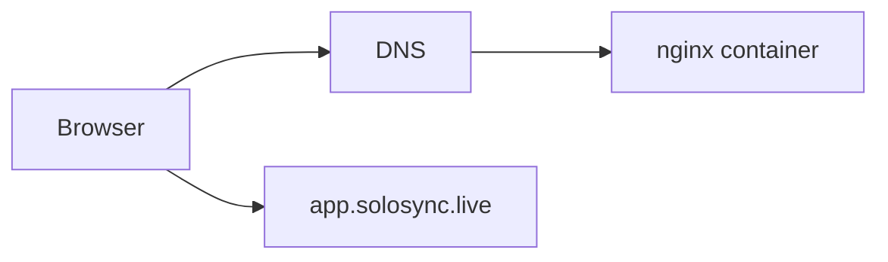

# Architecture

The company site is a static React/Vite application built into an immutable Docker image and served by nginx. No application secrets are required. The user application is hosted separately at app.solosync.live.

The same image can be deployed to Azure Container Apps, GCP Cloud Run, or OCI Container Instances. Cloud-specific provisioning belongs in the organization infra repository.