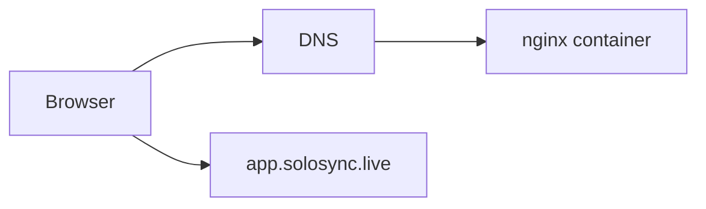

# Architecture

Static React/Vite site compiled into an immutable Docker image and served by nginx. No runtime secrets are required.

Deploy the same image to Azure Container Apps, GCP Cloud Run, or OCI Container Instances. Cloud-specific provisioning belongs in solosynctech/infra.